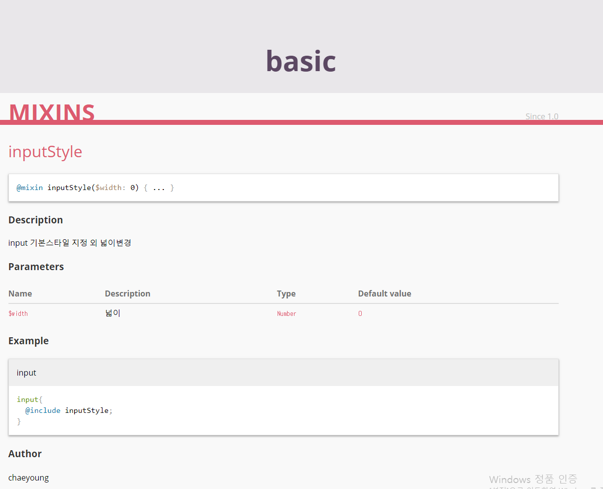

# Sassdoc

1. sassdoc 
- sass 라이브러리/프레임워크  사용법(api:변수,함수,믹스인 등)을 문서로 만들어주는 자동화도구
- jsdoc 과 유사하다
- 특정 구문 주석 인식 -> 모든 주석 수집 -> 테마에 맞춰 자동으로 html 문서로 만들어줌


2. 설치
````
$npm install sassdoc -g //전역
$npm install sassdoc --save-dev //devDepenencies 설치

````

3. 사용법
- 문서화 되어야 하는 항목에 /// 주석 처리
- 첫번째 행은 설명 을 작성 (제일 먼저 나와야 함)  <a href="http://sassdoc.com/annotations/">주석참조</a>

````
/// input 기본스타일 지정 외 넓이변경
/// @group basic
/// @author chaeyoung
/// @param {Number} $width - 넓이
/// @param {Number} $width {0} - 넓이
/// @example scss - input
///   input{
///     @include inputStyle;
///   }
````


4.dest
* grunt 및 gulp와 같은 자동화 도구용 플러그인을 사용하거나 
명령중에서 sassdoc 으로 실행
````
//ex 도구를 사용할 경우 pipe 통합
gulp.task ( 'sassdoc' , function  ()  {
     return gulp.src ( './sass/**/*.scss' )
        .pipe (sassdoc (sassdocOptions)) ....
});
````
````
//ex 터미널에서 sassdoc 실행
sassdoc {sass디렉토리}

출력
sassdoc {sass디렉토리} --dest{sassdoc 실행할디렉토리}//폴더 지정후 실행시 모든 파일이 사라지니 주의

제외 항목
sassdoc sass/'!sass/*'
````
