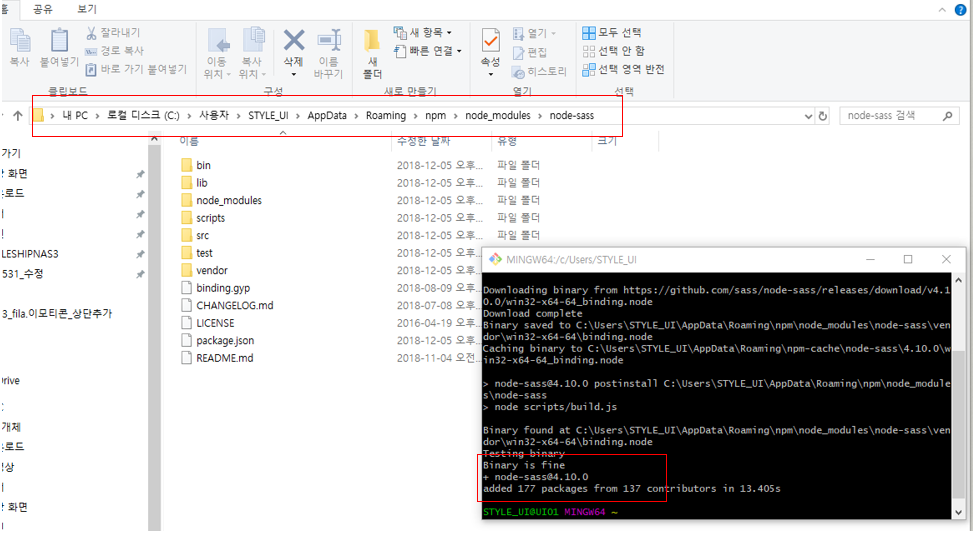
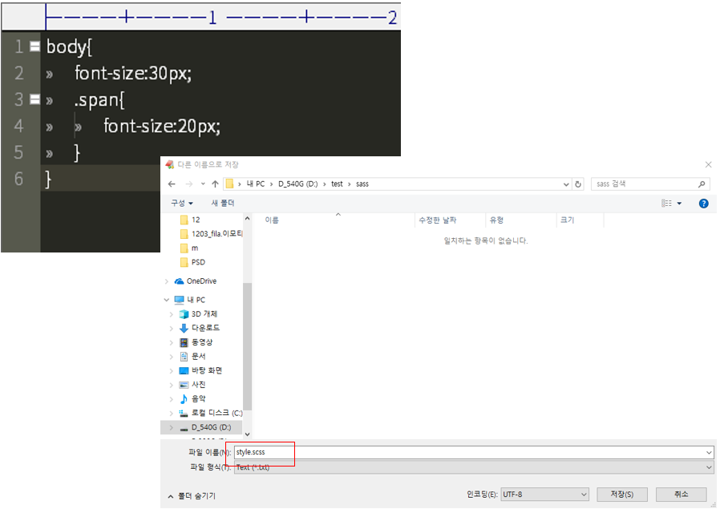
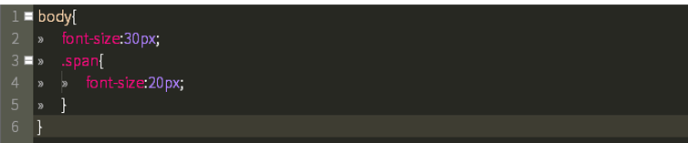
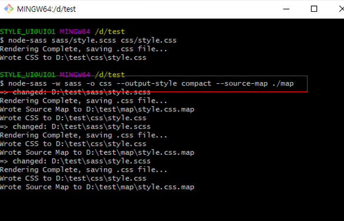
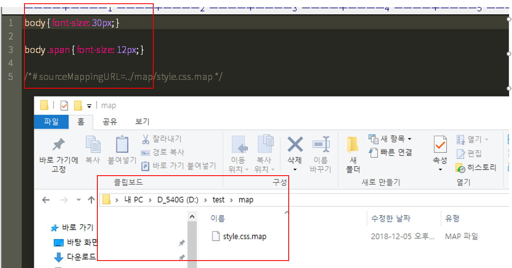

# NODE-SASS SETTING

## 1 .소프트웨어 설치
1. node.js 설치
* node.js LTS 버전을 다운로드 합니다 (대부분 사용자들에게 추천)


* 설치 후 윈도우 cmd 프롬프트 창을 열어준다
* node –v 를 입력하여 설치확인


2. git bash 설치
* https://git-scm.com/downloadsnode.js 사용할 버전을 다운로드 합니다(mac,window, linux …)


* 사용 하고 있는 에디터가 있다면 선택


* Git bash로만 사용할 예정이므로bash only 선택


* 기타 옵션 선택후 finish


---

## 2 .node-sass 설치
* 깃배쉬를 열어 입력


````
$ npm install node-sass # 프로젝트 로컬 설치
$ npm install node-sass --global # 컴퓨터 전역 설치
````


* sass 설치 확인




---

## 3. COMILE 
1. 로컬에 sass 적용
* 사용할 로컬에 폴더를 만들고 새 html 을 만든다
* 새로만든 폴더에 sass 와 css 폴더를 만든다
* 새파일을 열어 sass 문법을 적용시킨 후 scss 파일로 저장




* git bash 에서 로컬로 이동하여 입력


````
$ node-sass sass/style.scss css/style.css
````

* 적용이되면 scss 파일의 구문이 강조된 걸 확인할 수 있다 (색상변경이 안된다면 에디터 마다 scss 설정을 해줘야함)



* 이제 css 폴더로 가보자 style.css 가 생긴걸 확인 할 수 있다 (컴파일이 됬다는 뜻)

</br>

2. sass  관찰 명령어

* scss 파일이 변경될때 마다 자동으로 컴파일 해주는 관찰 명령어 를 입력



````
$ node-sass --watch --recursive sass --output css 
$ node-sass -w -r sass -o css --output-style expanded --source-map ./map 
````
````
* 소스맵 - Scss 파일을 컴파일 하여 css 를 배포한후 
브라우저에서 css 오류 발생시 
Scss 파일의 오류난 코드의 위치를 알려주는 파일로 유용 
````


* css 파일이 한줄로 바뀐걸확인 할 수 있다 
* 소스맵 파일 확인




**옵션**

명령어|설명
---|---
--help |도움말 출력 
-v, --version Sass |버전 정보 출력
--output-style |CSS 출력 스타일 설정 (nested ,expanded ,compact , compressed) 
-w, --watch |디렉토리/파일 관찰 
-o, --output | 출력 디렉토리 설정
-r, --recursive | 하위 디렉토리/파일 포함하여 관찰 
-q, --quiet | 컴파일 오류 발생 로그 말고는 로그(기록)를 제한하는 설정 
--indent-type | CSS 변환 파일에 사용될 들여쓰기 유형 설정 (space | tab) 
--indent-width | spaces 또는 tabs의 개수 설정 (최댓값: 10) 
--source-map | 소스맵 설정 
--precision | 소수점 자리 설정 (기본값: 4) 

</br>

**css 출력 방식**
명령어|설명
---|---
compact | 한줄로 정리(촘촘하게)
compress | 압축(공백없이)
expanded | 확장
nested | 중첩

3. 컴파일 저장