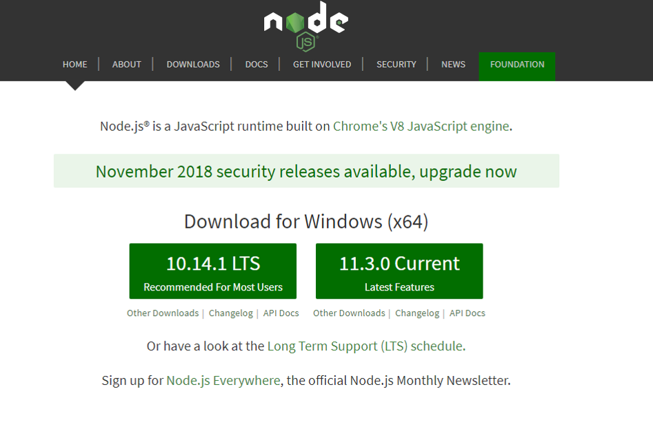
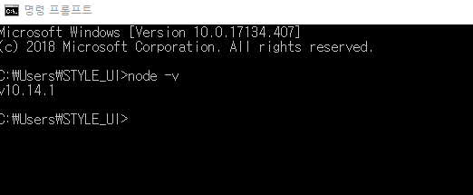
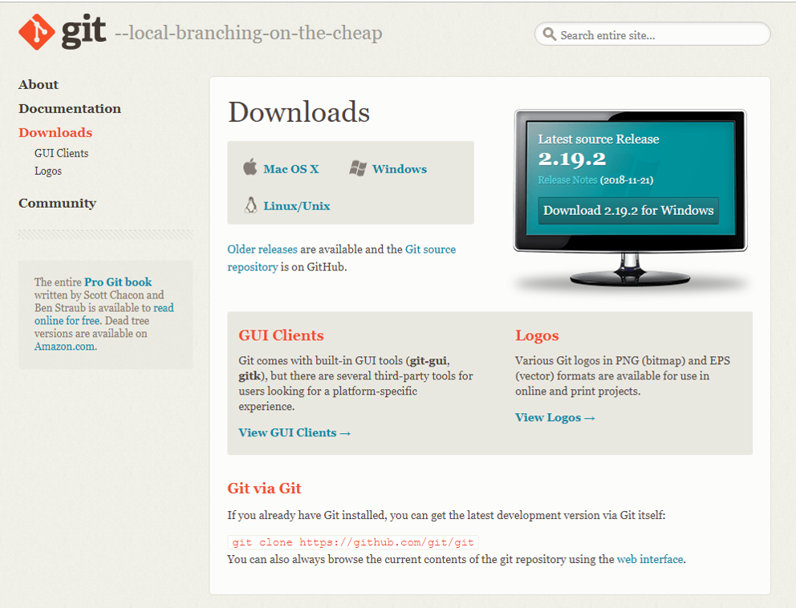
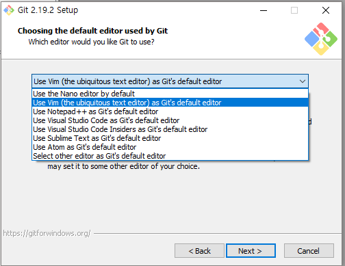
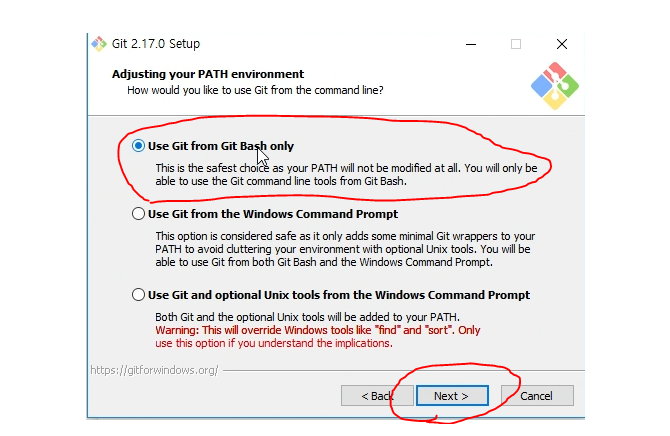
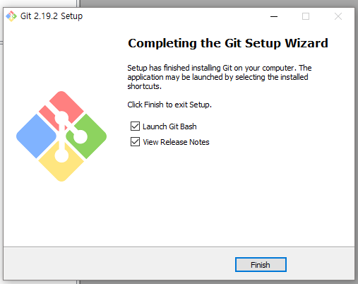
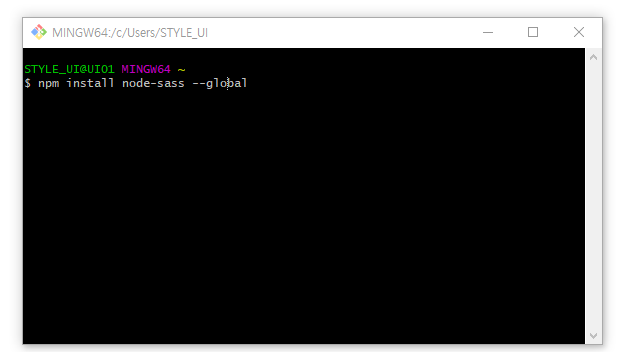

# NODE-SASS SETTING

## 1 .소프트웨어 설치
1. node.js 설치
* node.js LTS 버전을 다운로드 합니다 (대부분 사용자들에게 추천)



* 설치 후 윈도우 cmd 프롬프트 창을 열어준다
* node –v 를 입력하여 설치확인



2. git bash 설치
* https://git-scm.com/downloadsnode.js 사용할 버전을 다운로드 합니다(mac,window, linux …)



* 사용 하고 있는 에디터가 있다면 선택



* Git bash로만 사용할 예정이므로bash only 선택



* 기타 옵션 선택후 finish



---

## 2 .node-sass 설치
* 깃배쉬를 열어 입력


````
$ npm install node-sass --global
````
````
$ npm install node-sass # 프로젝트 로컬 설치
$ npm install node-sass --global # 컴퓨터 전역 설치
````


* sass 설치 확인
